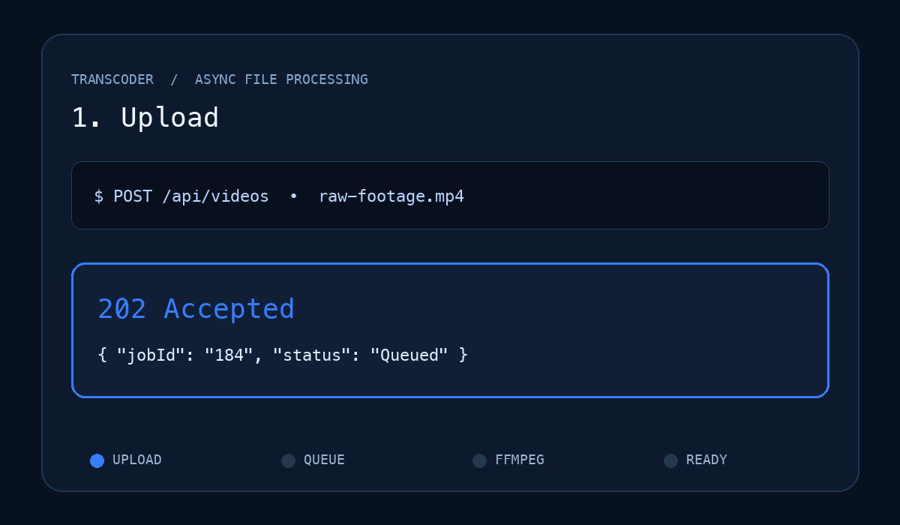

# Transcoder: Async Video Compressor

An asynchronous MP4/MOV processing backend for B.Y.T.E AVIP 2026 Backend Task 9. It stores an upload securely, returns `202 Accepted` and a Job ID immediately, then BullMQ workers use FFmpeg in the background to create a compressed MP4 and JPEG thumbnail.



## Architecture

```text
multipart upload -> Express API -> Redis/BullMQ -> FFmpeg worker -> shared output volume
       |                 |                |                    |
       +---- 202 Job ID -+---- polling ---+---- download -------+
```

## Run with Docker

Docker includes Redis and FFmpeg, so this is the fastest complete setup:

```bash
docker compose up --build
```

The API is then available at `http://localhost:3000`.

## Local development

Requirements: Node.js 22.5+, Redis, and FFmpeg (`ffmpeg -version`).

```bash
npm install
docker run --rm -p 6379:6379 redis:8-alpine
npm start
npm run worker
```

Run API/unit tests with `npm test`.

## API flow

Upload an MP4 or MOV. The field name must be `video`.

```bash
curl -i -X POST http://localhost:3000/api/videos \
  -F 'video=@./raw-footage.mp4;type=video/mp4'
```

The request is non-blocking:

```json
{
  "data": {
    "jobId": "1",
    "status": "Queued",
    "statusUrl": "/api/jobs/1"
  }
}
```

Poll until it completes:

```bash
curl http://localhost:3000/api/jobs/1
```

```json
{
  "data": {
    "jobId": "1",
    "status": "Completed",
    "progress": 100,
    "attemptsMade": 1,
    "maxAttempts": 3,
    "assets": {
      "video": "/api/jobs/1/download/video",
      "thumbnail": "/api/jobs/1/download/thumbnail"
    }
  }
}
```

Download the results:

```bash
curl -OJ http://localhost:3000/api/jobs/1/download/video
curl -OJ http://localhost:3000/api/jobs/1/download/thumbnail
```

## Security and reliability

- Uploads have a configurable 500 MB cap by default.
- Only MP4/QuickTime MIME types are accepted, and the ISO Base Media `ftyp` signature is checked after upload.
- Original filenames are sanitized and never used as output paths.
- Download routes accept only queue-generated numeric job IDs and fixed asset kinds, preventing path traversal.
- Failed jobs retry three times with exponential backoff; source uploads are deleted on success or final failure.
- Redis makes job state visible to independently scaled API and worker processes.

For production, add authenticated uploads, malware scanning, object storage, per-user quotas, signed download URLs, and durable job event telemetry.

## License

MIT
